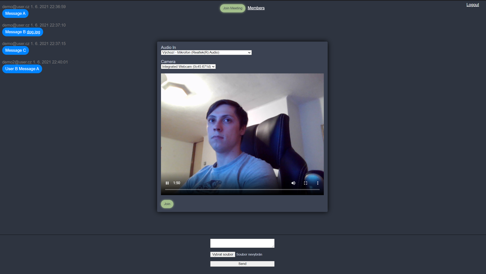

# Uživatelská dokumentace

## Upozornění

Aplikace je napsána s využítím moderních technologií, momentálně bez jekékoli ambice podporovat staré verze prohlížečů, či alternativní webové prohlížeče. Testováno v posledních verzích firefoxu a chrome.

## Pojmy

- Schůzka: Živý videohovor jednoho či více účastníků.
- Místnost: Nabízí funkcionalitu pro vybrané uživatele (její členy).

# 1. Část pro anonymní (nepřihlášené) uživatele

## Domovská stránka

### Registrace

Je možné se zaregistrovat pomocí registračního formuláře.

**Poznámka**: Momentálně není implementováno ověření účtu, proto je možné se ihned po zaregistrování přihlásit.

**Upozornění**: Momentálně není implementován proces obnovy hesla, proto je silně doporučeno nepřijít o registrační údaje. V opačném  případě je nutné kontaktovat správce aplikace.

### Přihlášení

Je možné se přihlásit pomocí přihlašovacího formuláře. Přihlášením je získán přístup do části aplikace s funkcionalitou pro přihlášené uživatele. Přihlášení funguje na bázi "sezení", uživatel zůstává přihlášen i po obnovení stránky, nikoli však při restartování prohlížeče, počítače, či použití nového tabu prohlížeče. 

# 2. Část pro přihlášené uživatele

## Domovská stránka

### Odhlašovací tlačítko

Při kliknutí na tlačítko dojde k odhlášení uživatele a přesměrování do části pro nepřihlášené uživatele.

### Seznam místností

Obsahuje seznam místnotí, které uživatel vlastní, či do kterých byl přizván ostatními uživateli. Kliknutím na jméno místnosti dojde k otevření stránky místnosti a ověření členství, čímž je získán přístup do části aplikace s funkcionalitou pro členy místnosti.

**Upozornění**: Při přizvání uživatele do místnosti se uživatel stává členem místnosti bez jeho explicitního souhlasu. 

### Vytvoření místnosti

Je možné vytvořit novou místnost pomocí formuláře.

# 3. Část pro členy místnosti

## Domovská stránka

### Chat

Obsahuje historii textové komunikace v místnosti. Je možné vytvářet nové zprávy pomocí chat formuláře, mj. poslat soubory. Zprávy jsou dlouhodobě uchovávány a není je možné mazat ani upravovat.

**Upozornění**: Momentálně není implementován zabezpečený přístup k souborům. Ostatně ten není implementován ani v případě např. facebooku. Kdokoli zná adresu k souboru na serveru, má k němu přístup. Adresa je náhodně generována a tak poskytuje alespoň základní zabezpečení.

### Tlačítko členové

Otevře okno s členy místnosti.

### Okno členové místnosti

Obsahuje výpis členů místnosti a formulář pro přidání člena místnosti.

**Upozornění**: Momentálně není možné rušit členství. Také není možné nastovovat práva, který uživatel smí přizvat nové členy (smí všichni členové).

### Tlačítko připojení ke schůzce

Otevře okno s přípravou přípojení ke schůzce.

### Okno příprava připojení ke schůzce

Obsahuje možnost nastavit audio vstup (mikrofon) a video vstup (webkamera) a náhled těchto zařízení (tedy co bude přenášeno). Dále obsahuje tlačítko pro zahájení schůzky. Schůzky je možné se účastnit i bez jakéhokoli vstupu, tedy pouze jako "posluchač, pozorovatel".

**Upozornění**: Náhled vlastních zařízení (co je přenášeno ostatním) v okně přípravy i při průběhu samotné shůzky obsahuje kontrolní prvky (pozastavení, hlasitost, zobrazení na plnou šíři monitoru, ...). Tyto prvky nemají vliv na to, co je přenášeno, tedy pozastavím-li náhled, je pozastaven pouze u mě, avšak stále se přenáší a ostatní uživatelé mě dále uvidí. Pro tyto účely (vypnutí přenášení videa, ztlumení mikrofonu, ...) je potřeba využít explicitních tlačítek k tomu určených, popsaných v tomto dokumentu.  

### Schůzka

Po připojení ke schůzce je zobrazen náhled vlastního přenášeného vstupu nejvíce vlevo. Následují videa ostatních členů schůzky. V průběhu schůzky je možné používat chat.

### Sdílení obrazovky

V průběhu schůzky je možné sdílet obrazovku příslušným tlačítkem u vlastního náhledu. Po kliknutí na tlačítko se objeví okno umožňující výběr obrazovky (monitor, okno aplikace, ...). Sdílení je tlačítkem možné zase vypnout.

### Ztlumení mikrofonu

V průběhu schůzky je možné ztlumit (vypnout) vlastní audio vstup (mikrofon) příslušným tlačítkem u vlastního náhledu. Ztlumení je tlačítkem možné zase zrušit.

### Vypnutí přenášení videa

V průběhu schůzky je možné pozastavit (vypnout) vlastní video vstup (webkameru) příslušným tlačítkem u vlastního náhledu. Pozastavení je tlačítkem možné zase zrušit.

### Tlačítko opustit schůzku

Schůzku je možné tlačítkem opustit, čímž dojde ke zrušení spojení videohovoru s ostatními členy. 

